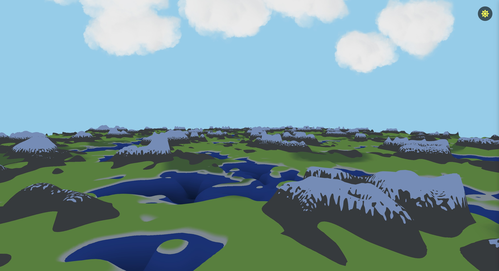

# Terrain

This project showcases a dynamic terrain and cloud system with day-to-night transitions, using Three.js and GLSL shaders. The terrain is generated using a plane geometry with Simplex 2D noise, creating realistic hills and dips. Various colors are applied to simulate terrain features like grass, rocks, sand, and snow, and a blending function is used to mimic shadows as if they were passing by on the grass. Animated clouds are added to enhance the realism, and a day-to-night toggle allows the scene and cloud colors to dynamically change based on the time of day.



---

## Features

- **Dynamic Terrain** 
The terrain is created using a plane geometry and Simplex 2D noise to simulate hills and dips in the landscape.

- **Terrain Textures** 
Multiple terrain colors (grass, rock, sand, snow) are blended based on the terrain height and slope, creating realistic surface transitions.

- **Shadow Mimicry** 
A blend function simulates the movement of shadows passing over the terrain, particularly on the grass areas, enhancing the effect of light passing through the scene.

- **Animated Clouds** 
Clouds are animated in the sky, adding a dynamic and ever-changing element to the scene.

- **Day/Night Toggle** 
The scene allows toggling between day and night modes. The terrain colors and cloud colors change based on the current time of day, providing a dynamic lighting experience.

## Technologies Used

- **Three.js**  
  For rendering the 3D environment.

- **React Three Fiber**  
  For integrating Three.js with React.

- **GSAP**  
  For cloud animations.

- **Shaders**  
  Used to create elevation and dips, as well as to place appropriate colors.

## Getting Started

1. Clone this repository:
   ```bash
   git clone https://github.com/psaemiyan/terrain.git
2. Navigate to the project directory:
    ```bash
    cd terrain
3. Install dependencies:
    ```bash
    npm install
4. Start the development server:
    ```bash
    npm run dev